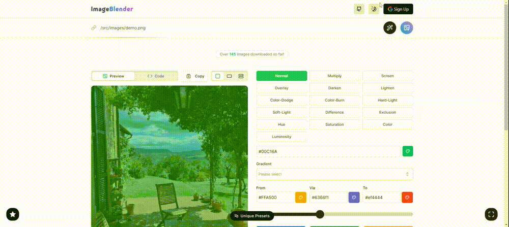

# Image Blender

[ImageBlender](https://imageblender.vercel.app/) is an open-source project for blending images. It allows users to upload or paste an image link, apply blend effects, copy the generated code, download image and so on.


## Demo

[Live view](https://imageblender.vercel.app/) of the project.

## 📜 Features

- **Paste or Upload Images:** Easily paste image links or upload your images directly into the application.
- **Blend Effects:** Apply various blend modes, such as multiply, screen, overlay, and more
- **Gradient Effects:** Customize your images further with gradient effects, allowing you to blend colors seamlessly.
- **Unique Presets:** Choose from a variety of aesthetically pleasing presets for quick and beautiful styling.
- **View and Copy Code:** Instantly view the generated tailwind CSS code for the applied effects and copy it to your clipboard with a single click.
- **Download Modified Images:** Download your modified images with the applied effects directly from the app.


## Prerequisites

Before cloning this project, make sure you have the following tools installed:

On your computer

- [Git](https://git-scm.com/downloads)
- [VS Code](https://code.visualstudio.com/download) (or an IDE of your choice)
- [Pnpm](https://pnpm.io/)

## Installation

1. Clone the code by typing the following command:

```bash
git clone https://github.com/muhammadhafijur/image-blender
```

2. Navigate to the project directory and open the project

```bash
cd image-blender && code .
```

3. Install packages

```bash
pnpm install
```

4. Compile and Hot-Reload for Development

```bash
pnpm dev
```

## 📝 Contributing

Contributions are welcome! Here's how to get started:

1. **Report Issues:** Open an issue to report bugs or suggest new features.
2. **Fork the Repository:** Fork this repository to your own GitHub account.
3. **Submit a Pull Request:** Make your changes and submit a pull request with a brief description.

Thanks for helping improve this project!


## 🍃 Contributors

[//]: contributor-faces

<a href="https://github.com/muhammadhafijur"></a>

[//]: contributor-faces